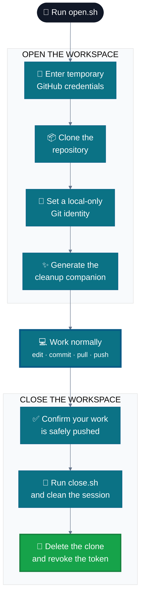

<div align="center">

# ✦ Git Anywhere

### Your GitHub workspace, wherever you happen to be.

<p>
  <strong>Open a session · Work normally · Leave the computer clean</strong>
</p>

[](https://www.gnu.org/software/bash/)
[](https://github.com/)
[](LICENSE)

<br>

**Git Anywhere is a guided Bash workflow for working with your GitHub repositories
from a borrowed or shared computer—without forgetting the important cleanup steps.**

[Get started](#-quick-start) · [See how it works](#-how-it-works) · [Read the FAQ](#-frequently-asked-questions)

</div>

---

## ✨ Why Git Anywhere?

You are in a classroom, a computer lab, or at a friend's house. You need to make
a quick change, but configuring Git by hand means remembering several sensitive
steps both **before** and **after** the work.

Git Anywhere makes that experience simple and repeatable:

<table>
<tr>
<td width="33%" align="center">
<h3>⚡ Fast setup</h3>
One command guides you through cloning and configuring your workspace.
</td>
<td width="33%" align="center">
<h3>🔒 Local identity</h3>
Your Git name and email are applied only to the repository you clone.
</td>
<td width="33%" align="center">
<h3>🧹 Guided cleanup</h3>
A session-specific closing script helps remove temporary configuration when you leave.
</td>
</tr>
</table>

No permanent installation. No long setup checklist. Just a focused temporary
workspace that behaves like a familiar Git environment.

## 🖥️ The experience

```text
  ┌──────────────────────────────────────┐
  │  Temp session · GitHub               │
  └──────────────────────────────────────┘

  GitHub user:  octocat
  Token:        ••••••••••••••••
  Repository:   hello-world

  Cloning...
  ✓ Ready to work.

  Repo:      hello-world
  Identity:  The Octocat <octocat@github.com>

  Use git commit, git push and git pull as usual.
  When done:  ./close.sh
```

From there, you can use Git exactly as you normally would. When the work is
committed and pushed, one closing command starts the cleanup flow:

```bash
./close.sh
```

## 🧭 How it works



<div align="center">

### One small workflow, from first credential to final cleanup.

</div>

### What happens at each stage

| Stage | Git Anywhere takes care of… |
| :--- | :--- |
| **Authenticate** | Reading your GitHub username and token without displaying the token as you type. |
| **Clone** | Downloading one GitHub repository over HTTPS. |
| **Isolate** | Applying your commit name and email to that repository only. |
| **Protect** | Disabling Git's credential helper locally for the clone. |
| **Prepare** | Creating an executable, repository-specific `close.sh`. |
| **Clean** | Removing the authenticated remote URL and local Git identity. |
| **Exit** | Removing the temporary helpers and closing the terminal after confirmation. |

## 🚀 Quick start

### What you need

- **Bash** and **Git**
- Network access to GitHub
- Standard Unix utilities (`sed`, `truncate`, `rm`, and `kill`)
- A GitHub personal access token for the repository you want to use

Git Anywhere is designed for Bash-compatible environments including Linux,
macOS, WSL, and Git Bash.

### 1. Prepare a temporary token

Create a fine-grained GitHub personal access token with access to the repository
you need. A short expiration time and repository-specific access are recommended.

### 2. Place the opener in a temporary folder

Put `open.sh` in a location you can remove after the session. Keep it outside the
repository you plan to clone.

### 3. Open your workspace

```bash
bash open.sh
```

Enter your GitHub username, token, repository name, and preferred Git commit
identity when prompted. Use the repository's simple name—`my-project`, for
example—rather than a full URL.

### 4. Build something

```bash
cd my-project

# Work just as you would on your own computer
git status
git add .
git commit -m "feat: make something great"
git push
```

### 5. Make sure your work is safe

Before cleanup, confirm that every important change is committed and pushed:

```bash
git status
git log --oneline --decorate -5
git push
```

### 6. Close your workspace

```bash
./close.sh
```

Read the confirmation prompt carefully. After the script finishes, delete the
cloned repository directory and revoke the temporary token if it is still valid.

## 🧹 What `close.sh` cleans

The closing companion is generated specifically for the current session. After
you confirm, it:

- replaces the authenticated `origin` URL with a token-free GitHub URL;
- removes the repository-local Git name and email;
- removes the local credential-helper override;
- attempts to clear Bash command history;
- deletes the original opener and then itself; and
- closes its parent terminal process after a short countdown.

It deliberately **does not delete your cloned repository**. You remain in
control of that final destructive step, giving you one last opportunity to
confirm that your work is safely stored on GitHub.

## 📁 Project layout

```text
git-anywhere/
├── open.sh        # Opens and configures a temporary GitHub work session
├── README.md      # Project guide
└── LICENSE        # Apache License 2.0
```

`close.sh` is created inside the cloned repository at runtime. It is added to
that clone's local Git exclude file so it does not appear in `git status` or get
committed accidentally.

## ❔ Frequently asked questions

<details>
<summary><strong>Does this install anything permanently?</strong></summary>

No. Git Anywhere uses tools already present in your Bash environment and applies
Git configuration only inside the cloned repository.

</details>

<details>
<summary><strong>Does this sign me out of GitHub everywhere?</strong></summary>

No. It cleans the configuration associated with this local clone. It does not
terminate browser, GitHub CLI, IDE, or other device sessions.

</details>

<details>
<summary><strong>Does the closing script delete my repository?</strong></summary>

No. It reminds you to delete the cloned directory yourself. This avoids
automatically destroying work that may not have been pushed yet.

</details>

<details>
<summary><strong>Why use a temporary token?</strong></summary>

A short-lived, repository-scoped token keeps the session focused and is easy to
revoke afterward. You should avoid using a broad, long-lived credential on a
computer you do not own.

</details>

<details>
<summary><strong>Can I cancel the cleanup?</strong></summary>

Yes. `close.sh` asks for confirmation first. Answering anything other than `y`
or `Y` cancels cleanup so you can return to your work.

</details>

## 🤝 Contributing

Contributions are welcome—particularly improvements to portability, credential
handling, recovery from interrupted sessions, and automated testing.

Please keep changes focused, explain any security implications, and write commit
messages using [Conventional Commits](https://www.conventionalcommits.org/).

## ⚖️ License

Git Anywhere is available under the [Apache License 2.0](LICENSE). It offers
flexibility to use, modify, and distribute the project while retaining copyright
and license notices, and it includes an explicit patent grant.

## ⚠️ Security and responsible use

Git Anywhere helps you follow a consistent cleanup routine, but no script can
make an unknown computer fully trustworthy or promise a forensic-trace-free
session. A host with sufficient access may observe process arguments, files,
memory, keystrokes, clipboard contents, or network activity.

For the safest practical experience:

1. Prefer a guest account, live environment, or ephemeral virtual machine.
2. Create a fine-grained token for only the repository you need.
3. Give the token the shortest practical expiration and minimum permissions.
4. Avoid placing the token on the clipboard.
5. Commit and push all important work before running `close.sh`.
6. Delete the cloned repository directory when cleanup is complete.
7. Revoke the token and check that no browser, IDE, or GitHub CLI session remains.

<details>
<summary><strong>Read the technical limitations</strong></summary>

- The token is part of the HTTPS clone URL while `git clone` runs and remains in
  the clone's `origin` URL until cleanup succeeds.
- Cleanup depends on successfully running `close.sh`; interruption, power loss,
  or closing the terminal early may leave session information behind.
- Bash history cleanup may affect existing history and cannot erase logs, caches,
  backups, swap, or monitoring records maintained elsewhere by the host.
- The script does not clean browser sessions, SSH agents, GitHub CLI sessions,
  IDE accounts, editor history, recent-file lists, or operating-system logs.
- `close.sh` forcefully terminates its parent process, so unrelated terminal work
  should be saved first.

</details>

> [!CAUTION]
> Use Git Anywhere only on computers you are authorized to use. Follow the rules
> of managed school and workplace devices, and never use it to bypass an
> organization's security policy.

---

<div align="center">

### Work wherever you need to. Leave with confidence.

Made for temporary sessions, careful developers, and one less thing to forget.

</div>
